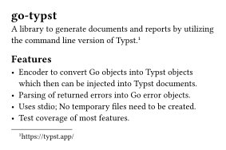
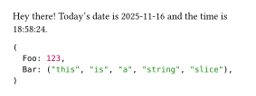

# go-typst [](https://github.com/Dadido3/go-typst/actions/workflows/test.yml)

`go-typst` is a Go library that leverages the command-line interface of [Typst] to provide functions for the creation of documents and reports in various formats (PDF, SVG, PNG, HTML).
Its goal is to provide Go developers with a seamless, "Go-like" interface to Typst's powerful document generation capabilities.

## Stability and Compatibility

`go-typst` is a work in progress, and the API may change as Typst evolves.
Supported Typst versions are tested by unit tests to ensure compatibility.

**Supported Versions:**

- Typst 0.12.0
- Typst 0.13.0
- Typst 0.13.1
- Typst 0.14.0

While breaking changes may occur, i aim to minimize disruptions.
Use at your own discretion for production systems.

## Features

- PDF, SVG, PNG and HTML generation.
- All Typst parameters are discoverable and documented in [options.go](options.go).
- Go-to-Typst Value Encoder: Seamlessly encode any Go values as Typst markup.
- Encode and inject images as a Typst markup simply by [wrapping](image.go) `image.Image` types or raw image data.
- Errors from Typst CLI are returned as structured Go error objects with detailed information, such as line numbers and file paths.
- Uses stdio; No temporary files will be created.
- Supports native Typst installations and the official Docker image.
- Good unit test coverage.

## Installation

Use `go get github.com/Dadido3/go-typst` inside of your project to add this module to your project.

## Usage

This module needs either a native installation of Typst, or a working Docker installation.
The following subsections will show how to use this library in detail.

### Native Typst installation

The basic usage pattern for calling a natively installed Typst executable looks like this:

```go
typstCaller := typst.CLI{}

err := typstCaller.Compile(input, output, options)
```

In this case the module assumes that the Typst executable is accessible from your system's PATH.
Ensure that you have [Typst] installed on any machine that your project will be executed.
You can install it by following [the instructions in the Typst repository].

Alternatively you can pack the Typst executable with your application.
In this case you have to provide the path to the executable when setting up the `typst.CLI` object:

```go
typstCaller := typst.CLI{
    ExecutablePath: "./typst", // Relative path to executable.
}
```

> [!NOTE]
> Make sure to follow the Typst license requirements when you pack and distribute the Typst executable with your software.

### Official Docker image

To use the official Typst Docker image ensure that you have a working Docker installation.

`go-typst` will automatically pull and run a Docker container with the latest supported Typst image.
The basic usage pattern is similar to the CLI variant:

```go
typstCaller := typst.Docker{}

err := typstCaller.Compile(input, output, options)
```

#### Tips and tricks

As the Typst instance that's running inside the container is fully encapsulated, you have pass through any resources manually.
This requires a bit more set up than using a native installation.

Let's say you want to compile a document which imports other local Typst markup files.
In this case you have to ensure that you mount any needed folders and files to the Docker container.
You also have to set up the root of Typst to that mounted directory, or a parent of it:

```go
typstCaller := typst.Docker{
    Volumes: []string{"./test-files:/markup"},
}

r := bytes.NewBufferString(`#include "hello-world.typ"`)

var w bytes.Buffer
err := typstCaller.Compile(r, &w, &typst.OptionsCompile{Root: "/markup"})
```

This will mount `./test-files` to `/markup` inside the Docker container.
When Typst compiles the input buffer `r`, it expects `./test-files/hello-world.typ` to exist outside of the container.

Another thing is that the Dockerized version of Typst doesn't see your system fonts.
To get all your system fonts mounted into the container, you can add the volume parameter `/usr/share/fonts:/usr/share/fonts` to your `typst.Docker`.
For example:

```go
typstCaller := typst.Docker{
    Volumes: []string{
        "./test-files:/markup",
        "/usr/share/fonts:/usr/share/fonts",
    },
}
```

The same applies when you want to use custom fonts.
You need to mount the folder containing the fonts, and then you have to tell Typst where the fonts are mounted to inside the container:

```go
typstCaller := typst.Docker{
    Volumes: []string{"./test-files:/fonts"},
}

err := typstCaller.Compile(input, output, &typst.OptionsCompile{FontPaths: []string{"/fonts"}})
```

## Caller interface

`typst.CLI` and `typst.Docker` both implement the `typst.Caller` interface.

## Examples

### Simple document

Here we will create a simple document by passing a reader with Typst markup into `typstCaller.Compile` and then let it write the resulting SVG data into a file:

```go
func main() {
    markup := bytes.NewBufferString(`#set page(width: 100mm, height: auto, margin: 5mm)
= go-typst

A library to generate documents and reports by utilizing the command line version of Typst.
#footnote[https://typst.app/]

== Features

- Encoder to convert Go objects into Typst objects which then can be injected into Typst documents.
- Parsing of returned errors into Go error objects.
- Uses stdio; No temporary files need to be created.
- Test coverage of most features.`)

    typstCaller := typst.CLI{}

    f, err := os.Create(filepath.Join(".", "documentation", "images", "readme-example-simple.svg"))
    if err != nil {
        t.Fatalf("Failed to create output file: %v.", err)
    }
    defer f.Close()

    if err := typstCaller.Compile(markup, f, &typst.OptionsCompile{Format: typst.OutputFormatSVG}); err != nil {
        t.Fatalf("Failed to compile document: %v.", err)
    }
}
```

Output:



### Value injection

If you need to create documents that rely on data coming from your Go application, you can use `typst.InjectValues` to encode any Go variables, structures, maps, arrays, slices into their respective Typst markup counterparts:

```go
func main() {
    customValues := map[string]any{
        "time":       time.Now(),
        "customText": "Hey there!",
        "struct": struct {
            Foo int
            Bar []string
        }{
            Foo: 123,
            Bar: []string{"this", "is", "a", "string", "slice"},
        },
    }

    // Inject Go values as Typst markup.
    var markup bytes.Buffer
    if err := typst.InjectValues(&markup, customValues); err != nil {
        t.Fatalf("Failed to inject values into Typst markup: %v.", err)
    }

    // Add some Typst markup using the previously injected values.
    markup.WriteString(`#set page(width: 100mm, height: auto, margin: 5mm)
#customText Today's date is #time.display("[year]-[month]-[day]") and the time is #time.display("[hour]:[minute]:[second]").

#struct`)

    f, err := os.Create(filepath.Join(".", "documentation", "images", "readme-example-injection.svg"))
    if err != nil {
        t.Fatalf("Failed to create output file: %v.", err)
    }
    defer f.Close()

    typstCaller := typst.CLI{}
    if err := typstCaller.Compile(&markup, f, &typst.OptionsCompile{Format: typst.OutputFormatSVG}); err != nil {
        t.Fatalf("Failed to compile document: %v.", err)
    }
}
```

Output:



### More examples

It's also possible to write Typst templates that can be invoked from `go-typst`.
A full setup can be found in the [passing-values example package](examples/passing-values).

[the instructions in the Typst repository]: https://github.com/typst/typst?tab=readme-ov-file#installation
[Typst]: https://typst.app/
