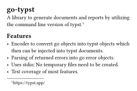

# go-typst [](https://github.com/Dadido3/go-typst/actions/workflows/test.yml)

`go-typst` is a Go library that leverages the command-line interface of [Typst] to provide functions for the creation of documents and reports in various formats (PDF, SVG, PNG).
Its goal is to provide Go developers with a seamless, "Go-like" interface to Typst's powerful document generation capabilities.

## Stability and Compatibility

`go-typst` is a work in progress, and the API may change as Typst evolves.
Supported Typst versions are tested by unit tests to ensure compatibility.

**Supported Versions:**

- Typst 0.12.0
- Typst 0.13.0
- Typst 0.13.1

While breaking changes may occur, i aim to minimize disruptions.
Use at your own discretion for production systems.

## Features

- PDF, SVG and PNG generation.
- All Typst parameters are discoverable and documented in [cli-options.go](cli-options.go).
- Go-to-Typst Value Encoder: Seamlessly inject any Go values (Including `image.Image` with a [wrapper](image.go)) into Typst documents via the provided encoder.
- Errors from Typst CLI are returned as structured Go error objects with detailed information, such as line numbers and file paths.
- Uses stdio; No temporary files will be created.
- Good unit test coverage.

## Installation

1. Use `go get github.com/Dadido3/go-typst` inside of your project to add this module to your project.
2. Install Typst by following [the instructions in the Typst repository].

## Runtime requirements

This module assumes that the Typst executable is accessible from your system's PATH.
Ensure that you have [Typst] installed on any machine that your project will be executed.
You can install it by following [the instructions in the Typst repository].

Alternatively you can pack the Typst executable with your application.
In this case you have to provide the path to the executable when setting up the `typst.CLI` object:

```go
typstCLI := typst.CLI{
    ExecutablePath: "./typst", // Relative path to executable.
}
```

> [!NOTE]
> Make sure to follow the Typst license requirements when you pack and distribute the Typst executable with your software.

## Usage

Here we will create a simple PDF document by passing a reader with Typst markup into `typstCLI.Compile` and then let it write the resulting PDF data into a file:

```go
func main() {
    r := bytes.NewBufferString(`#set page(width: 100mm, height: auto, margin: 5mm)
= go-typst

A library to generate documents and reports by utilizing the command line version of Typst.
#footnote[https://typst.app/]

== Features

- Encoder to convert Go objects into Typst objects which then can be injected into Typst documents.
- Parsing of returned errors into Go error objects.
- Uses stdio; No temporary files need to be created.
- Test coverage of most features.`)

    typstCLI := typst.CLI{}

    f, err := os.Create("output.pdf")
    if err != nil {
        t.Fatalf("Failed to create output file: %v.", err)
    }
    defer f.Close()

    if err := typstCLI.Compile(r, f, nil); err != nil {
        t.Fatalf("Failed to compile document: %v.", err)
    }
}
```

The resulting document will look like this:



[the instructions in the Typst repository]: https://github.com/typst/typst?tab=readme-ov-file#installation
[Typst]: https://typst.app/
